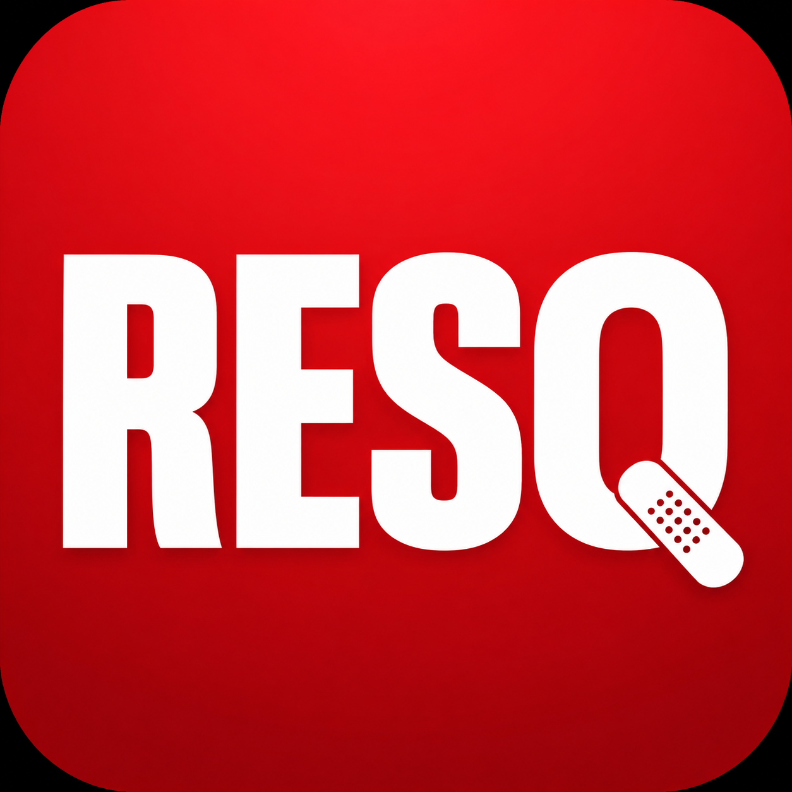

<table>
  <tr>
    <td>
      
    </td>
    <td>
      <h1>RESQ – Interactive Digital First-Aid Assistant</h1>
      <i>"In an emergency, every second counts."</i>
    </td>
  </tr>
</table>

---

## 📌 Table of Contents
- [Problem](#-problem)
- [Solution](#-solution)
- [Features](#-features)
- [Tech Stack](#-tech-stack)
- [Demo](#-demo)
- [Team](#-team)
- [SDGs](#-sdgs)
---

##  Problem
In emergency situations, most people panic and lack the knowledge to provide immediate first-aid. Existing solutions are English-only, text-heavy, and inaccessible to non-English speakers and people in rural areas.

---

##  Solution
RESQ is a web-based interactive first-aid assistant that guides users through emergencies in their own language — with voice input, home remedies, and real-time hospital finding.

---

##  Features
- 🩹 **Injury Selector** – Visual menu for quick injury identification
- 🎙️ **Voice Input** – Speak in Telugu/Hindi, no typing needed
- 🌿 **Indian Home Remedies** – Turmeric, aloe vera, neem based suggestions
- 📊 **Severity Checker** – Mild / Moderate / Severe classification
- 🏥 **Nearby Hospital Finder** – Real-time location based search
- 📞 **One-Tap 108 Call** – Direct emergency dial

---

## Tech Stack

---

##  Demo
> Full demo video coming soon — EPL '26 Week 2 Submission

---

##  Team
**Team Phoenix** | EPL '26 – Med Mavericks Track

| Name |
|---------------|
|Nandhitha Ratan|
|Shikha Maity   |
|Sree Vidhya    |

---

##  SDGs
| Goal | Description |
|------|-------------|
|  | Providing accessible first-aid guidance |
|  | Educating users on emergency response |

---

*Built with ❤️ for EPL '26 | Stanley College of Engineering | Code Crypt*
