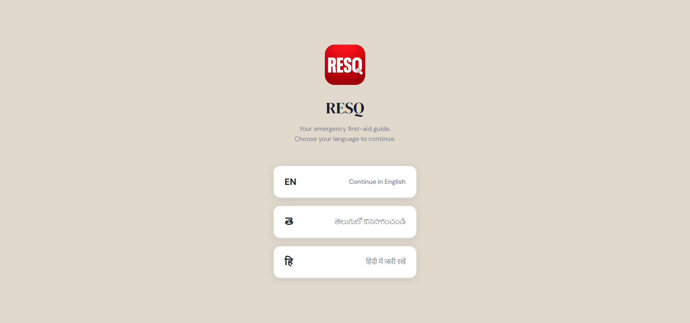
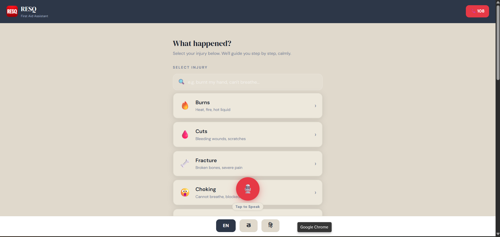
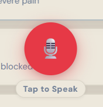
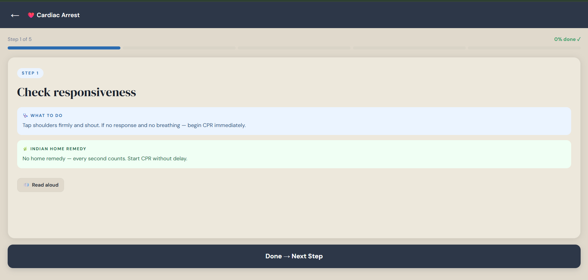
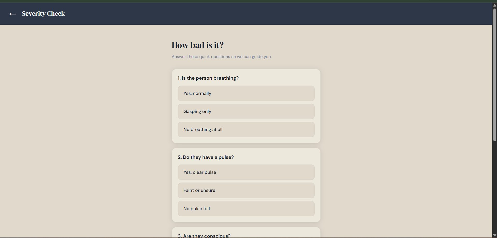
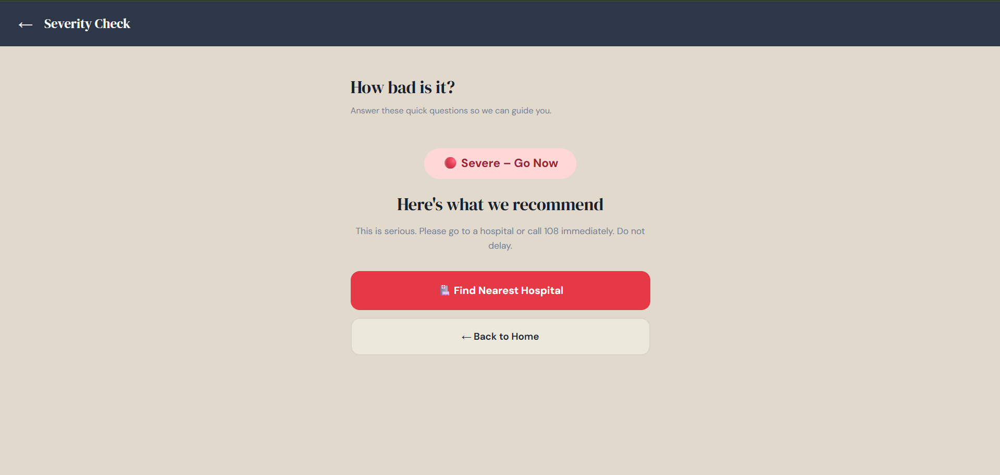
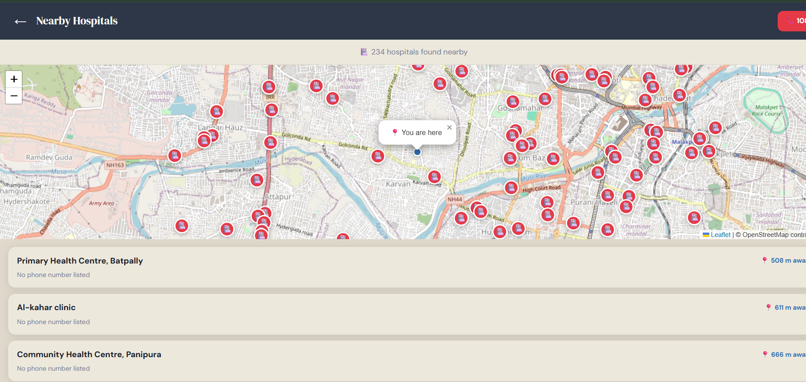

<div align="center">


# RESQ — Interactive Digital First-Aid Assistant

### *"In an emergency, every second counts."*

[](.)
[](.)
[](.)
[](.)
[](.)
[](.)
[](.)
[](.)

**Team Phoenix** | EPL '26 | Stanley College of Engineering | Med Mavericks Track | Problem Code: MM-01-S2

[Nandhitha Ratan](.) · [Shikha Maity](.) · [Sree Vidhya](.)

</div>

---
<div align="center">
<a href="#">🚀 Live Demo</a> · <a href="#final-gallery">📸 Screenshots</a> · <a href="#installation-guide">🛠 Installation</a> · <a href="#visual-architecture">🗺 Architecture</a>
</div>

## 📋 Table of Contents

<a href="#product-overview">Product Overview</a> •
<a href="#un-sdg-global-impact">UN SDG Global Impact</a> •
<a href="#key-features">Key Features</a> •
<a href="#tech-stack">Tech Stack</a> •
<a href="#visual-architecture">Visual Architecture</a> •
<a href="#installation-guide">Installation Guide</a> •
<a href="#module-reference">Module Reference</a> •
<a href="#error-handling--resilience">Error Handling</a> •
<a href="#final-gallery">Final Gallery</a> •
<a href="#4-week-development-journey">4-Week Journey</a> •
<a href="#team">Team</a>

---

## 🩺 Product Overview

**RESQ** is a browser-based, multilingual, interactive first-aid assistant that guides anyone through a medical emergency in real time — with zero installation, zero account, and zero medical background required.

Most people in India freeze during emergencies because nobody ever taught them what to do. The resources that exist are English-only, text-heavy, and assume calm — which is exactly the opposite of what an emergency looks like. In rural areas, the nearest hospital can be an hour away or more, making home-level first response genuinely life-or-death.

RESQ fills that gap:

- **Speaks your language** — full support for English, Telugu, and Hindi
- **Voice-first** — speak your problem instead of typing during a panic
- **Culturally grounded** — Indian home remedies (turmeric, aloe vera, neem) alongside clinical steps
- **Covers 20 emergencies** — from burns and cuts to cardiac arrest, stroke, snake bite, and more
- **Works anywhere** — opens in any browser, no install, no account, no internet required for core guidance

> Built for the general public, rural communities, students, and anyone caught in an emergency with no idea what to do.

---

## 🌍 UN SDG Global Impact

### SDG 3 — Good Health & Well-being

Every second counts in a medical emergency, yet most people freeze because they simply don't know what to do. In India, a large portion of the population has no access to quick, reliable medical guidance — especially those who don't speak English.

RESQ directly tackles this by giving anyone, anywhere, instant step-by-step first aid instructions the moment something goes wrong. The built-in severity checker stops panic-driven mistakes before they happen. A one-tap 108 emergency call and a real-time nearby hospital finder ensure help is never more than a few seconds away.

### SDG 4 — Quality Education

First aid is one of the most important life skills a person can have, yet it is completely ignored in Indian schools. Students spend years in classrooms but graduate without knowing how to treat a burn or stop bleeding.

RESQ fills this gap — and doesn't stop at urban students. For people in remote areas, tribal regions, and villages where the nearest hospital can be hours away, knowing first aid isn't a bonus skill, it's survival. The Indian home remedies feature teaches users to use what's already in their backyards and kitchens. Every time someone in a remote village uses RESQ, they're not just getting immediate help — they're learning traditional healing methods that have worked for generations.

> **RESQ doesn't just respond to emergencies. It educates communities to handle them — bridging the gap between health and knowledge, one user at a time.**

---

## ✨ Key Features

| Feature | Description |
|---|---|
| 🩹 **Injury Selector** | Visual menu — pick from 20 emergency types instantly |
| 🎙️ **Voice Input** | Speak in Telugu or Hindi — no typing needed during a panic |
| 🌿 **Indian Home Remedies** | Turmeric, aloe vera, neem-based suggestions alongside standard care |
| 📊 **Severity Checker** | 4-question scoring system — classifies Mild / Moderate / Severe |
| 🏥 **Hospital Finder** | Real-time GPS map, sorted by proximity, with phone numbers |
| 📞 **One-Tap 108 Call** | Direct emergency dial — zero friction |
| 🔊 **Read Aloud (TTS)** | Full voice playback of every step in the selected language |
| 🔍 **Smart NLP Search** | Type or describe symptoms — intelligent keyword matching |
| 🌐 **3-Language UI** | Every screen, label, and message available in EN / TE / HI |

---

## 🛠 Tech Stack

| Technology | Role | Why We Chose It |
|---|---|---|
| **HTML5** | App structure | Universal, runs on any browser, zero installation |
| **CSS3** | Styling & layout | Clean, panic-friendly UI with smooth animations |
| **JavaScript (ES6)** | All app logic | Runs directly in browser — no server needed |
| **Bootstrap 5** | Responsive design | Auto-adjusts for mobile; large tappable buttons |
| **Web Speech API** | Voice input + TTS | Built into modern browsers; supports Telugu & Hindi |
| **Leaflet.js** | Interactive map | Lightweight, open-source, no API key |
| **OpenStreetMap** | Map tiles | Free, community-maintained, zero cost |
| **Overpass API** | Hospital search | Queries real hospitals within 5km — no billing risk |

> **Note on Google Maps:** The original proposal listed Google Maps API. During development we replaced it — Google Maps requires a paid API key and has quota limits that could fail mid-demo. Our open-source stack (Leaflet + OSM + Overpass) is completely free, has no limits, and is actually more customizable.

---

## 🗺 Visual Architecture

### System Block Diagram

```
┌─────────────────────────────────────────────────────────────┐
│                        USER DEVICE                          │
│                   (Any Modern Browser)                      │
└───────────────────────────┬─────────────────────────────────┘
                            │
                    ┌───────▼────────┐
                    │   index.html   │  ← Entry point
                    │  (108 lines)   │
                    └───────┬────────┘
                            │  loads in order
          ┌─────────────────┼──────────────────────┐
          │                 │                      │
    ┌─────▼──────┐   ┌──────▼──────┐   ┌──────────▼────────┐
    │  data.js   │   │ severity.js │   │    voice.js        │
    │            │   │             │   │                    │
    │ All injury │   │ 4 questions │   │ Web Speech API     │
    │ data EN/   │   │ per injury  │   │ Voice Input (STT)  │
    │ TE / HI    │   │ Score 0-2   │   │ Read Aloud (TTS)   │
    │ UI strings │   │ Mild/Mod/   │   │ EN / TE / HI       │
    └────────────┘   │ Severe      │   └────────────────────┘
                     └─────────────┘
          ┌─────────────────┼──────────────────────┐
          │                 │                      │
    ┌─────▼──────┐   ┌──────▼──────┐   ┌──────────▼────────┐
    │  search.js │   │   maps.js   │   │     app.js         │
    │            │   │             │   │                    │
    │ NLP filter │   │ GPS locate  │   │ Screen manager     │
    │ 20 groups  │   │ Leaflet map │   │ Language switcher  │
    │ EN/TE/HI   │   │ Overpass    │   │ Step renderer      │
    │ keywords   │   │ Haversine   │   │ Severity trigger   │
    └────────────┘   │ Sort/cards  │   │ 108 call utility   │
                     └──────┬──────┘   └────────────────────┘
                            │
              ┌─────────────┼──────────────┐
              │             │              │
    ┌─────────▼──┐  ┌───────▼──────┐  ┌───▼────────────┐
    │ Device GPS │  │ OpenStreetMap│  │ Overpass API   │
    │ (Browser   │  │ (Map tiles)  │  │ (Hospital data │
    │  Geoloc.)  │  │ Free/no key  │  │  within 5km)   │
    └────────────┘  └──────────────┘  └────────────────┘
```

### App Screen Flow

```
┌──────────────┐     select      ┌──────────────┐     tap injury
│ LANGUAGE     │────────────────►│ HOME SCREEN  │──────────────┐
│ SCREEN       │                 │              │              │
│ EN / TE / HI │◄────────────────│ Injury list  │              ▼
└──────────────┘    goHome()     │ Search bar   │     ┌────────────────┐
        ▲                        │ Voice FAB    │     │  STEP SCREEN   │
        │                        │ 108 button   │     │                │
        │           goHome()     └──────────────┘     │ Progress bar   │
        │◄──────────────────────────────────────────  │ Step N of M    │
        │                                             │ WHAT TO DO     │
        │                                             │ HOME REMEDY    │
        │                                             │ Read Aloud btn │
        │                                             │ Next Step btn  │
        │                                             └───────┬────────┘
        │                                                     │ last step
        │                                                     ▼
        │                                           ┌─────────────────┐
        │                                           │ SEVERITY SCREEN │
        │                                           │                 │
        │                                           │ 4 questions     │
        │                                           │ scored 0–2 each │
        │                                           └────────┬────────┘
        │                                                    │ submit
        │                            ┌───────────────────────┼───────────────┐
        │                            │                       │               │
        │                     ┌──────▼────┐          ┌───────▼────┐  ┌───────▼────┐
        │                     │  MILD 🟢  │          │MODERATE 🟡 │  │ SEVERE 🔴  │
        │◄────────────────────│ Back Home │          │ Back Home  │  │ Call 108   │
                              │ at home   │          │ or doctor  │  └─────┬──────┘
                              └───────────┘          └────────────┘        │
                                                                            ▼
                                                                   ┌────────────────┐
                                                                   │  MAP SCREEN    │
                                                                   │ GPS → Leaflet  │
                                                                   │ Overpass 5km   │
                                                                   │ Sorted by dist │
                                                                   │ ← back arrow   │
                                                                   └────────────────┘
```

### Back Navigation Reference

| Screen | Back Arrow (←) goes to | Notes |
|---|---|---|
| Home | Language screen | via `goHome()` → `showScreen('lang')` |
| Step screen | Home screen | stops TTS, resets step index |
| Severity screen | Step screen (last step) | ← header arrow |
| Map screen | Severity result | ← header arrow |

### Severity Scoring Logic

```
Total Score = Sum of all 4 answers (each 0, 1, or 2)
Max possible = 8

Score ≤ 2  (≤ 25%)  →  🟢 MILD      — Handle at home
Score ≤ 4  (≤ 60%)  →  🟡 MODERATE  — Monitor, visit doctor
Score > 4  (> 60%)  →  🔴 SEVERE    — Hospital / Call 108 now
```

---

## 💻 Installation Guide

RESQ requires **no build tools, no package manager, and no server**. It runs entirely in the browser.

### Prerequisites

- Any modern browser: Chrome (recommended), Firefox, Edge, or Safari
- Git installed on your machine
- For voice features: Chrome browser on desktop or Android

### Step 1 — Clone the Repository

```bash
git clone https://github.com/YOUR_USERNAME/resq-first-aid.git
```

### Step 2 — Navigate into the Project

```bash
cd resq-first-aid
```

### Step 3 — Open the App

**Option A — Direct file open (simplest)**
```bash
# On macOS
open index.html

# On Linux
xdg-open index.html

# On Windows
start index.html
```

**Option B — Local server (recommended for full GPS + voice features)**

Using Python (built into macOS/Linux):
```bash
# Python 3
python3 -m http.server 8000

# Python 2
python -m SimpleHTTPServer 8000
```

Using Node.js:
```bash
npx serve .
```

Using VS Code Live Server extension:
```
Right-click index.html → Open with Live Server
```

Then open your browser and go to:
```
http://localhost:8000
```

### Step 4 — Grant Permissions

When prompted by the browser:
- **Allow Location Access** — required for the nearby hospital finder
- **Allow Microphone Access** — required for voice input in Telugu/Hindi

### File Structure

```
resq-first-aid/
│
├── index.html          ← Main entry point (108 lines)
├── style.css           ← All styling and layout
│
├── data.js             ← Injury data (EN/TE/HI) + UI translations
├── severity.js         ← Severity questions + scoring logic
├── voice.js            ← Web Speech API: voice input + Read Aloud
├── search.js           ← NLP keyword filter for injury search
├── maps.js             ← Leaflet map + Overpass hospital finder
├── app.js              ← Screen management + core app logic
│
├── assets/
│   ├── logo.png        ← RESQ logo
│   └── screenshots/    ← App screenshots
│
└── README.md           ← This file
```

### Browser Compatibility

| Browser | Voice Input | Read Aloud | Maps | Recommended |
|---|---|---|---|---|
| Chrome (desktop) | ✅ | ✅ | ✅ | ⭐ Best |
| Chrome (Android) | ✅ | ✅ | ✅ | ⭐ Best mobile |
| Firefox | ❌ | ✅ | ✅ | Good |
| Safari (iOS 16+) | ⚠️ Limited | ✅ | ✅ | Partial |
| Edge | ✅ | ✅ | ✅ | Good |

> Voice input requires Chrome. All other features work across all modern browsers.

---

## 📦 Module Reference

### `data.js`
Holds all injury data across three languages and all UI text translations.

```javascript
injuriesData['en']  // Array of 20 English injury objects
injuriesData['te']  // Array of 20 Telugu injury objects
injuriesData['hi']  // Array of 20 Hindi injury objects

T['en']  // UI text strings in English
T['te']  // UI text strings in Telugu
T['hi']  // UI text strings in Hindi
```

Each injury object:
```javascript
{
  icon: "🔥",
  name: "Burns",
  desc: "Heat, fire, hot liquid",
  steps: [
    {
      instruction: "Cool the burn",
      normal: "Hold under cool running water for 10 minutes...",
      remedy: "After cooling, apply fresh aloe vera gel..."
    },
    // ... more steps
  ]
}
```

### `severity.js`
Severity questions and scoring for every injury in all 3 languages.

```javascript
getSevQs(injuryName, lang)
// Returns array of 4 questions with options and scores

calcSeverityLevel(answers, totalQuestions, lang)
// Returns { level, cls, msg, hospital, sl }
// level: "🟢 Mild" | "🟡 Moderate" | "🔴 Severe"
```

### `voice.js`
```javascript
toggleVoice()
// Starts/stops Web Speech API voice recognition
// Maps spoken keywords → injury index → startInjury()

speakStep()
// Reads current step aloud using SpeechSynthesisUtterance
// Handles race condition: waits for voices to load before speaking
```

### `search.js`
```javascript
filterInjuries(query)
// Real-time NLP filter — hides non-matching injury cards

matchInjuryIndex(query)
// Returns injury index (0–19) from natural language input
// Covers 20 keyword groups in EN, TE, and HI
```

### `maps.js`
```javascript
openMaps()
// Requests GPS, initialises Leaflet map, queries Overpass API

searchHospitals(lat, lng)
// Fetches hospitals/clinics within 5km via Overpass
// Sorts by Haversine distance, renders cards + map markers

getDistanceKm(lat1, lng1, lat2, lng2)
// Haversine formula — returns straight-line km distance
```

### `app.js`
```javascript
setLang(l)         // Switch language: 'en' | 'te' | 'hi'
showScreen(id)     // Navigate between screens: 'lang' | 'home' | 'step' | 'severity' | 'map'
startInjury(i)     // Load injury by index (with bounds check: 0–19)
renderStep()       // Render current step content + progress bar
nextStep()         // Advance step or trigger severity check on last step
showSeverity()     // Build and show severity question screen
calcSeverity()     // Compute result and display badge + recommendation
goHome()           // Return to home screen, cancel TTS, reset state
call108()          // Trigger tel:108 link
```

---

## 🛡 Error Handling & Resilience

Five critical failure points identified and fixed during Week 3:

| # | Error | File | Type | Fix |
|---|---|---|---|---|
| 1 | Invalid injury index from voice match | `app.js` | Out-of-bounds | Boundary check in `startInjury()` — logs warning and stops instead of crashing |
| 2 | Browser popup blocker prevents hospital finder | `app.js` | Null window ref | Falls back to same-tab redirect — always opens |
| 3 | Microphone denied or network error during voice | `voice.js` | `onerror` | Shows "Mic blocked" / "Network error" on button; auto-resets after 2s |
| 4 | Text-to-speech not supported by browser | `voice.js` | Missing API | Null check on `window.speechSynthesis` + `currentInjury` guard |
| 5 | TTS voices not loaded on first call | `voice.js` | Race condition | `onvoiceschanged` callback waits for browser to finish loading voices |

---

## 📸 Final Gallery

### Language Selection Screen
*First screen — choose English, Telugu, or Hindi to continue.*



---

### Home Screen — Injury Selector
*20 emergencies listed with icons. Search bar and voice FAB (red mic button) visible. Language switcher at the bottom.*



---

### Voice Input Button
*Red floating mic button — tap to speak your emergency in Telugu, Hindi, or English.*



---

### Step-by-Step First Aid — Full View
*Step 1 of 5 for Cardiac Arrest. Progress bar at top. "WHAT TO DO" and "INDIAN HOME REMEDY" cards. Read Aloud button. "Done → Next Step" bar at bottom.*




### Severity Checker — Questions
*4 targeted questions per injury type, each scored 0–2. Scroll to answer all before submitting.*



---

### Severity Result — Severe
*Score > 4/8 → 🔴 Severe. "Find Nearest Hospital" button opens the live map. "Back to Home" available.*



---

### Nearby Hospital Map
*234 hospitals found in Hyderabad. Leaflet map with red markers. Sorted list below by distance — closest first. 108 button top-right.*



---

## 🗓 4-Week Development Journey

### Week 1 — Foundation
- Defined problem statement and target users
- Chose tech stack and justified every decision
- Built initial prototype: injury selector, severity checker, 108 call
- Covered 8 injury types in English only

### Week 2 — Core Feature Build
- Added Telugu and Hindi language support across all screens
- Integrated Web Speech API for voice input
- Built Indian home remedies feature
- Added Read Aloud (TTS) for accessibility
- Integrated real-time hospital finder (replaced Google Maps with Leaflet + Overpass)

### Week 3 — Resilience & Refactoring
- Identified and fixed 5 critical error handling cases
- Refactored 877-line monolithic `index.html` into 6 clean modules
- Expanded from 8 to 20 injury categories with full multilingual support
- Upgraded NLP search to cover all 20 injury groups in 3 languages
- Added SDG impact documentation

### Week 4 — Production Ready
- Full SDLC mapping and engineering report
- Architecture documentation and module reference
- Severity logic expanded to cover all 20 injuries in EN/TE/HI
- Production README (this document)
- Demo preparation for EPL finale

---

## 🌿 20 Emergencies Covered

| # | Injury | # | Injury |
|---|---|---|---|
| 1 | 🔥 Burns | 11 | 🧠 Stroke |
| 2 | 🩸 Cuts | 12 | 💉 Anaphylaxis |
| 3 | 🦴 Fracture | 13 | 💔 Heart Attack |
| 4 | 😮 Choking | 14 | ⚡ Seizure |
| 5 | 🌡️ Fever | 15 | 🐍 Snake Bite |
| 6 | 🐝 Insect Sting | 16 | 🌞 Heat Stroke |
| 7 | 💧 Nosebleed | 17 | 🤰 Pregnancy Emergency |
| 8 | 🤕 Head Injury | 18 | 👶 Child Febrile Seizure |
| 9 | ❤️ Cardiac Arrest | 19 | ☠️ Poisoning |
| 10 | 🩸 Severe Bleeding | 20 | 😵 Fainting |

---

## 👩‍💻 Team

| Name | Role |
|---|---|
| **Nandhitha Ratan** | Team Lead |
| **Shikha Maity** | Developer |
| **Sree Vidhya** | Developer |

**Team Phoenix** | EPL '26 | Stanley College of Engineering | Med Mavericks Track | Code Crypt

---

## 📄 License

This project is licensed under the [MIT License](LICENSE).

---

<div align="center">

*Built with ❤️ for EPL '26 | Stanley College of Engineering | Code Crypt*

*Dedicated to every person who has ever frozen in an emergency and wished they knew what to do.*

</div>
